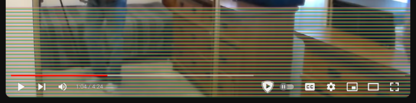
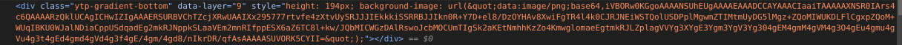
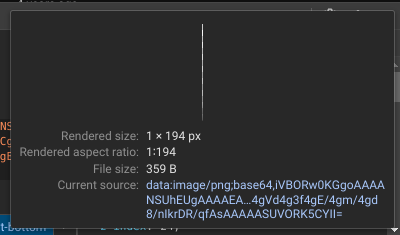
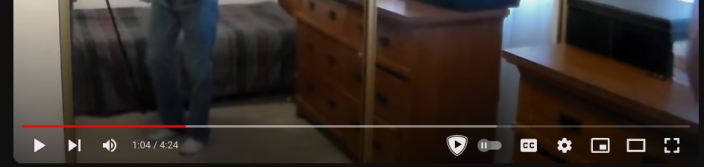
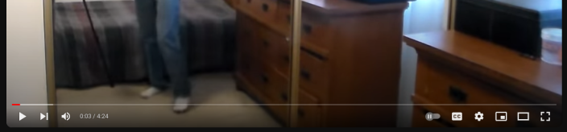

# YouTube Gradient Fix

YouTube has made a change to how their player draws the bottom gradient in a way that breaks when canvas readback is disabled (called "extract canvas data" on Firefox). This protection serves to improve privacy/tracking and is enabled by default on Firefox when using Enhanced Tracking Protection.

Unfortunately that causes the player to display this odd artifact:



This is caused by the seemingly unnecessary creation of a gradient image using a canvas which is then applied to the bottom gradient element:





Why do I say this is "unnecessary"? Because the same exact effect can be done with a simple CSS gradient:

```css
.ytp-gradient-bottom {
  background-image: linear-gradient(transparent, #0009) !important;
}
```
With this, a nearly identical gradient effect is achieved. Here's the CSS gradient (top) vs the original canvas-based effect (bottom, size differences due to different browser and window size):





Thus eliminating the need for allowing canvas data extraction.

I do not know why it is done like this, maybe some bizarre optimization, but I have noticed absolutely no issues from using this fix.

You can use an extension like Stylus ([Firefox](https://addons.mozilla.org/en-US/firefox/addon/styl-us/)/[Chrome](https://chromewebstore.google.com/detail/stylus/clngdbkpkpeebahjckkjfobafhncgmne)) to use this fix, simply add a new style for `https://youtube.com` and paste the CSS rule above (also provided in the `userstyle.css` file).

You could alternatively simply disable the element with uBlock Origin ([Firefox](https://addons.mozilla.org/en-US/firefox/addon/ublock-origin/)/[Chrome](https://chromewebstore.google.com/detail/ublock-origin/cjpalhdlnbpafiamejdnhcphjbkeiagm)) or by using `display: none` in the CSS rule, but I would not recommend this as it makes it impossible to see the controls over a white background (though I have seen them change the design from time to time where the controls would have a drop shadow around them, but as of now they seem to be completely white).
